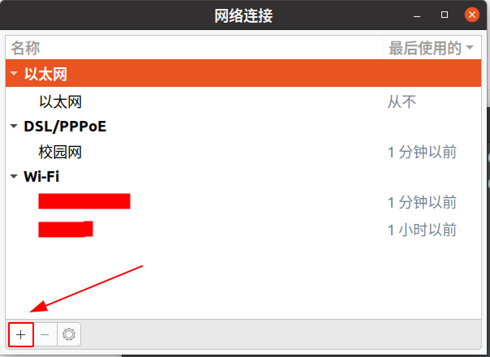
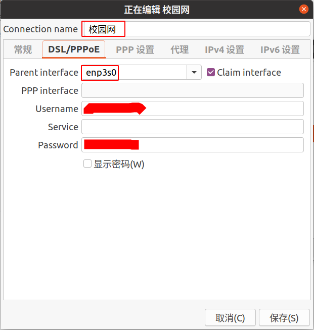
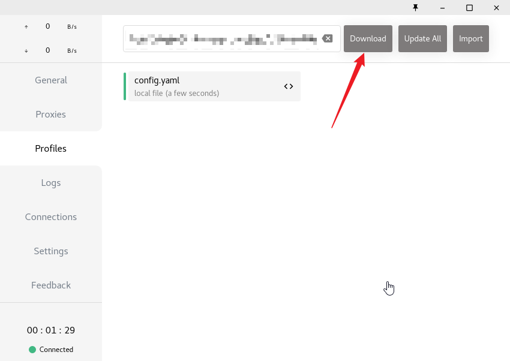
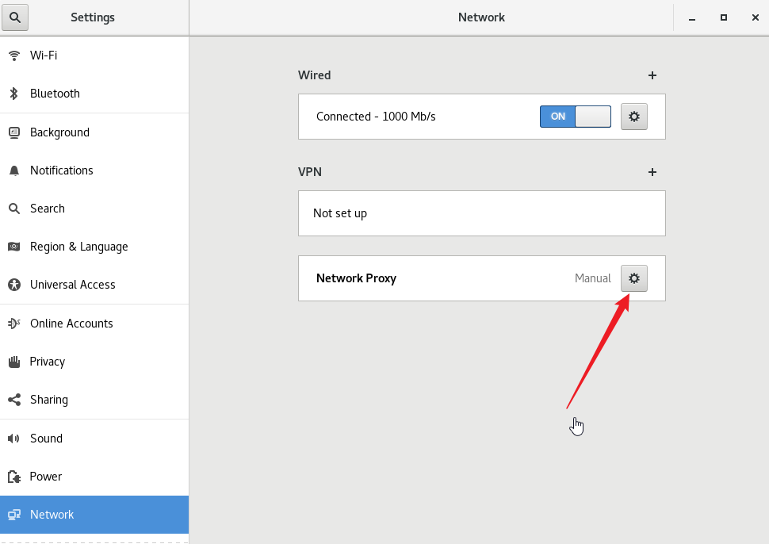
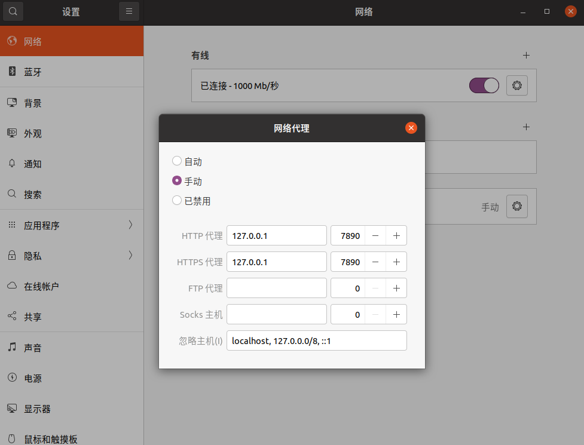

<!--
 * @Author       : Bingqiang Zhou
 * @Date         : 2023-09-09 16:33:32
 * @LastEditors  : Bingqiang Zhou
 * @LastEditTime : 2023-09-10 00:49:10
 * @Description  : 
-->

# 安装Windows、Ubuntu双系统记录

之前一直在虚拟机下跑R3live，由于内存(8GB)限制，大的数据跑不起来，装了一下双系统，其实装系统的过程也没什么太多好记录的，主要是想记录一下内核的切换以及安装驱动与应用等其他内容。

```txt
电脑型号：惠普战99 2023

配置：i5-13500H、RTX4050、声卡ALC236、网卡英特尔AX211

BIOS设置：
    F10 进入BIOS设置页面
    ESC 进入所有BIOS相关设置主页面，按相应功能键之后可以进入到对应设置页面
```

- [安装Windows、Ubuntu双系统记录](#安装windowsubuntu双系统记录)
  - [一、安装Ubuntu20.04系统](#一安装ubuntu2004系统)
    - [1.1、分区](#11分区)
    - [1.2、制作启动U盘](#12制作启动u盘)
    - [1.3、设置BIOS](#13设置bios)
    - [1.4、安装Ubuntu系统](#14安装ubuntu系统)
  - [二、驱动以及系统相关设置](#二驱动以及系统相关设置)
    - [2.1、拨号上网](#21拨号上网)
    - [2.2、切换软件源](#22切换软件源)
    - [2.3、切换内核](#23切换内核)
    - [2.4、跳过硬盘检测](#24跳过硬盘检测)
      - [2.4.1、设置方式](#241设置方式)
      - [2.4.2、/etc/fstab内容详解](#242etcfstab内容详解)
    - [2.5、安装lightdm桌面管理器](#25安装lightdm桌面管理器)
    - [2.6、安装NVIDIA显卡驱动](#26安装nvidia显卡驱动)
      - [2.6.1、查看显卡型号，确认NVIDIA显卡有被识别到](#261查看显卡型号确认nvidia显卡有被识别到)
      - [2.6.2、禁用 nouveau 驱动](#262禁用-nouveau-驱动)
      - [2.6.3、关闭图形界面](#263关闭图形界面)
      - [2.6.4、下载安装NVIDIA显卡驱动](#264下载安装nvidia显卡驱动)
    - [2.7、处理声卡未被识别的问题](#27处理声卡未被识别的问题)
      - [2.7.1、确认声卡驱动是否有效](#271确认声卡驱动是否有效)
      - [2.7.2、处理声卡未被识别的相关设置](#272处理声卡未被识别的相关设置)
      - [2.7.3、确认声卡是否正确被识别](#273确认声卡是否正确被识别)
  - [三、安装应用](#三安装应用)
    - [3.1、安装中文输入法（ibus-lib拼音）](#31安装中文输入法ibus-lib拼音)
    - [3.2、安装discover软件软件中心](#32安装discover软件软件中心)
    - [3.3、安装Clash](#33安装clash)
      - [3.3.1、下载运行Clash](#331下载运行clash)
      - [3.3.2、设置订阅链接](#332设置订阅链接)
      - [3.3.3、设置系统代理](#333设置系统代理)
      - [3.3.4、添加Clash到软件菜单](#334添加clash到软件菜单)
      - [3.3.5、添加Clash到任务栏](#335添加clash到任务栏)
    - [3.4、安装Wechat、QQMusic、QQ](#34安装wechatqqmusicqq)
      - [3.4.1、添加麒麟软件源](#341添加麒麟软件源)
      - [3.4.2、安装软件](#342安装软件)
    - [3.5、MiniConda、VSCode](#35minicondavscode)
  - [四、其他相关内容](#四其他相关内容)
    - [4.1、wifi驱动相关](#41wifi驱动相关)

## 一、安装Ubuntu20.04系统

由于**R3live**是在**ROS1**的环境下的，而ROS1的最后一个版本**Neotic**最高支持到**Ubuntu 20.04**，因此这里安装20.04系统。

### 1.1、分区

在windows **磁盘管理**中，**压缩卷**，给Ubuntu系统留出一块空间。

### 1.2、制作启动U盘

制作启动U盘，Windows下用[rufus](https://rufus.ie/en/)，MacOS下[balenaetcher](https://etcher.balena.io)【也有Windows和Linux版本】

### 1.3、设置BIOS

进入到BIOS中，关闭 **安全启动** 和 **快速启动**

### 1.4、安装Ubuntu系统

通过U盘启动，开始Ubuntu系统安装，其中分区情况如下，空间大小仅作为参考，需要根据实际情况给定：

```txt
1.EFI分区

重要性：必须设置，这个是引导分区，否则安装时会报错。

大小：200M-500M 实际分配2G
类型：逻辑分区
位置：空间起始位置 固态硬盘
用于：EFI系统分区

注意：启动设备选择efi分区

2./boot

如果您的硬盘不支持LBA模式(不太可能)，您最好挂载它，如果挂载，将它挂载在硬盘的第一个 分区，应该比较稳妥。一般来说，挂载的分区只要100M大小就足够了。

大小：2G
类型：逻辑分区
位置：空间起始位置 固态硬盘
用于：Ext4日志文件系统

3.swap交换分区

交换分区，可能不是必须的，不过按照传统，并且照顾到您的安全感，还是挂载它吧。它的容量 只要约等于您的物理内存就可以了

大小：16G
类型：主分区
位置：空间起始位置 固态硬盘
用于：交换空间

4./： 根目录

必须挂载的目录。存放系统文件，建议空间不要太小

大小：100G（大小不定，主要用来存放ubuntu系统文件）
类型：逻辑分区
位置：空间起始位置 固态硬盘
用于：Ext4日志文件系统

5./usr 应用程序目录

大部分的软件都安装在这里，如果您计划安装许多软件，建议也给它分配一个分区

大小：100G（存放用户程序，用户自行安装的程序存放在/usr/local/bin中）
类型：逻辑分区
位置：空间起始位置 机械硬盘
用于：Ext4日志文件系统

6./home 家目录

这是您的家目录，通常您自己创建的文件，都保存在这里，建议越大越好

大小：500G（大小不定，主要用来存放用户文件）
类型：逻辑分区
位置：空间起始位置 机械硬盘
用于：Ext4日志文件系统
```

参考链接：[Ubuntu22.04分区设置](https://blog.csdn.net/matlab001/article/details/127568267)

## 二、驱动以及系统相关设置

### 2.1、拨号上网

由于检测不到wifi时，会需要手机开热点用线连接来上网，但苹果手机还需要安装依赖包才能开启数据线热点（这条路也走不通），所以有时候需要插网线，并且在公寓，没有多余的网线，可能会出现需要拨号上网，以下是拨号上网的设置。

- 打开网络管理图形界面

```bash
nm-connection-editor
```



- 选择加号--->选择DSL/PPPoE-->进入下图



- Connnection name随意设置
- 修改Parent interface为有线网卡
- 设置Username和Password
- 保存并重启

参考链接：[Ubuntu20.04拨号上网、开热点](https://www.cnblogs.com/FaithALL/p/13268058.html)


### 2.2、切换软件源

按下 **windows键** 搜索 **软件与更新**

- 打开`Software & Updates`(紫色图标)，注意不是右边的`Software Update`(灰色图标)


- 将**下载来源改为阿里云**，如下图所示


- 更新源与软件，并重启

```bash
sudo apt-get update

sudo apt-get upgrade

reboot
```

### 2.3、切换内核

`Ubuntu 20.04.6 LTS`默认是`5.15`版本的内核，电脑比较新，调整屏幕亮度、调整声音大小、甚至是连接wifi都不行，升级到6.02就可以**调整屏幕亮度**和**连接wifi**了，但是调整声音大小还不行，需要再进行设置。

- 添加`tuxinvader/lts-mainline`，安装内核6.02，尝试过其他很多内核，大多进不去系统。

这里直接重启会自动更新`grub`，下次再进入就是6.02的内核了。

```bash
sudo add-apt-repository ppa:tuxinvader/lts-mainline -y

sudo apt-get install linux-generic-6.02

reboot
```

[Personal Package Archives (PPA)](https://launchpad.net/ubuntu/+ppas)

[tuxinvader/lts-mainline](https://launchpad.net/~tuxinvader/+archive/ubuntu/lts-mainline)

参考链接：
[解决惠普战99 2023 4050 安装ubuntu 20.04 扩展显示器不亮](https://blog.csdn.net/zwq577572137/article/details/131913165)

**安装其他版本内核**以及**卸载内核**可以参考下面的博客：

- [Linux系统-Ubuntu安装指定版本的内核](https://blog.51cto.com/u_16179749/6632626)
- [linux卸载内核](https://blog.csdn.net/w383117613/article/details/78535923)

### 2.4、跳过硬盘检测

当长时间不重启linux或异常断电后，linux系统在重启的时候一般会进行磁盘自检。

#### 2.4.1、设置方式

**可以修改配置跳过开机自检，修改文件/etc/fstab
若将/etc/fstab中pass选项的值改为0，就关闭了该盘的开机自检，启动速度会有很大提高。**

#### 2.4.2、/etc/fstab内容详解

/etc/fstab内容主要包括六列：(通过 空格 或 Tab 分隔)

- 第一列：设备名或者设备卷标名
- 第二列：设备挂载目录(/、home、sys等)
- 第三列：设备文件系统(ext4、ntfs、iso9660、swap 及 auto等)
- 第四列：挂载参数(auto、exec、ro、rw、user、users、owner、sync、async、dev、suid、noatime、relatime、flush、defaults等等)
- 第五列：指明是否要备份，(0为不备份，1为要备份，一般根分区要备份)
- 第六列：指明自检顺序。 (0为不自检，1或者2为要自检，如果是根分区要设为1，其他分区只能是2)。因此要使ubuntu不开机自检，只需将该列的值修改为0即可。
  
/etc/fstab就是在开机引导的时候自动挂载到linux的文件系统，磁盘被手动挂载之后都必须把挂载信息写入/etc/fstab这个文件中，否则下次开机启动时仍然需要重新挂载。

如果给计算机配了一块新磁盘，已经分区，格式化，挂载，但当计算机重启后，然后我们想让计算机启动时自动挂载，方法就是文件/etc/fstab下增加一行系统开机时会主动读取/etc/fstab这个文件中的内容，根据文件里面的配置挂载磁盘。

### 2.5、安装lightdm桌面管理器

- 安装`lightdm`桌面管理器，ubuntu 20.04默认桌面管理是`gdm3`,好像`gdm3`会和`NVIDIA`显卡有冲突，需要在`grub`中设置`nomodeset=0`才行，因此这里该用`lightdm`。

```bash
sudo apt-get install lightdm
```

- 可以通过以下命令切换回`gdm3`

```bash
sudo dpkg-reconfigure gdm3
```

### 2.6、安装NVIDIA显卡驱动

#### 2.6.1、查看显卡型号，确认NVIDIA显卡有被识别到

有的新显卡可能无法识别，可以通过以下命令查看显卡是否识别到了。有看到`NVIDIA Corporation Device`则是正确识别到了。

```bash
lspci | grep VGA
```

#### 2.6.2、禁用 nouveau 驱动

- 使用下述命令可以查看 nouveau 驱动是否运行

```bash
lsmod | grep nouveau
```

若有`nouveau`的输出，则说明 nouveau 驱动正在运行，则需要禁用nouveau驱动。

- 运行下述命令禁用该驱动

```bash
sudo bash -c "echo blacklist nouveau > /etc/modprobe.d/blacklist-nvidia-nouveau.conf"
sudo bash -c "echo options nouveau modeset=0 >> /etc/modprobe.d/blacklist-nvidia-nouveau.conf"
```

- 检查命令是否正确

```bash
cat /etc/modprobe.d/blacklist-nvidia-nouveau.conf
```

若出现下述结果说明命令正确：

```bash
blacklist nouveau
options nouveau modeset=0
```

- 更新设置并重启

```bash
sudo update-initramfs -u
sudo reboot
```

- 重启后重新输入下述命令

```bash
lsmod | grep nouveau
```

- 若没有任何输出说明禁用 nouveau 驱动成功

#### 2.6.3、关闭图形界面

- 查看图形界面状态

```bash
sudo service lightdm status
```

ctrl+c结束当前语句， 如果画框部分是active，则需要停止图形界面的，如果是inactive则可以进行下载安装显卡驱动了。

- 关闭图形界面

```bash
sudo service lightdm stop
```

#### 2.6.4、下载安装NVIDIA显卡驱动

- 下载NVIDIA显卡驱动

进入[NVIDIA显卡驱动官方下载地址网站](https://www.nvidia.com/Download/index.aspx)，选择对应的系统下载，复制下载地址，使用wget下载。

- 安装NVIDIA显卡驱动

- 安装相关依赖

```bash
sudo apt install gcc g++ make
```

- 安装驱动

```bash
sudo sh NVIDIA-Linux-x86_64-535.104.05.run
```

一步一步设置安装，安装完毕，输入`nvidia-smi`，若有类似输出显卡使用情况信息，证明显卡安装成功。

### 2.7、处理声卡未被识别的问题

调节声音时，显示的设备是`dummy output`，应该是声卡没有被识别到的问题。

#### 2.7.1、确认声卡驱动是否有效

- 输入以下命令，查看是否有找到声卡信息，没有输出，则需要进行后面几步的设置。

```bash
aplay -l
```

- 查看声卡驱动是否有安装

```bash
alsactl -v
```

- 安装并启动`pavucontrol`声音管理工具，只查看到`dummy output`，则完全确认是未识别到声卡。

```bash
sudo apt-get install pavucontrol

pavucontrol
```

#### 2.7.2、处理声卡未被识别的相关设置

- 安装`vim`，编辑`/etc/modprobe.d/alsa-base.conf`

```bash
sudo install vim
```

```bash
sudo gedit /etc/modprobe.d/alsa-base.conf
```

- 并在此文件的末尾添加选项

```txt
options snd-hda-intel dmic_detect=0
```

- 编辑`/etc/modprobe.d/blacklist.conf`

```bash
sudo gedit /etc/modprobe.d/blacklist.conf
```

- 然后在文件最后添加

```txt
blacklist snd_soc_skl
```

- 重启

```bash
reboot
```

#### 2.7.3、确认声卡是否正确被识别

- 重启并通过`aplay -l`, `pavucontrol`确认正确并识别，以及声音可以正确调节。

至此，驱动和系统设置基本差不多了，可以开始安装软件了。

参考链接：[Ubuntu18.04安装后检测不到集成声卡问题](https://blog.csdn.net/weixin_50263538/article/details/112866745)

## 三、安装应用

### 3.1、安装中文输入法（ibus-lib拼音）

- 更新系统软件包列表

```bash
sudo apt update
```

- 安装输入法框架ibus

```bash
sudo apt install ibus
```

- 安装输入法ibus-pinyin

```bash
sudo apt install ibus-pinyin
```

- 重新启动电脑
- 打开"Settings”（设置）应用程序。
- 在"Region & Language”（地区和语言）选项卡中，点击‘＋"按钮添加新输入法。
- 搜索并选择你安装的输入法引擎`Chinese(Intelligent Pinyin)`
- 确保你已经选择了正确的区域和语言设定。

至此，可以在顶部的菜单栏或者使用快捷键切换输入法了。

参考链接：

- [ubuntu20.04安装输入法](https://wenku.csdn.net/answer/53razny1fn)
- [安装ibus中文输入法(Linux/Ubuntu)](https://zhuanlan.zhihu.com/p/132558860)
- [Linux Ubuntu 20.04 安装中文输入法](https://www.cnblogs.com/spinIC/p/14593038.html)

### 3.2、安装discover软件软件中心

```bash
sudo apt install plasma-discover
```

### 3.3、安装Clash

clash是近期比较著名的代理软件，其便捷、多平台的特点吸引了大量的用户。clash有三种Clash For Windows 、Clash For Linux和clash for android 三个主要的分支，大家在使用时，可能会将分支Clash For Windows中的windows理解成windows系统下专用的分支。其实在这里，windows指的是带GUI界面的clash软件。在ubuntu中，相比较于安装Clash For Linux，Clash For Windows更为方便和直观，下面就来介绍Clash for Windows 软件在ubuntu下的安装过程。

#### 3.3.1、下载运行Clash

- 从Github库Release页[clash_for_windows_pkg](https://github.com/Fndroid/clash_for_windows_pkg/releases)下载`Clash.for.Windows-XXXXX-x64-linux.tar.gz`压缩包

- 解压压缩包

```bash
tar xvzf Clash.for.Windows-XXXXX-x64-linux.tar.gz
```

- 进入到压缩出来的目录下，运行clash_for_windows

```bash
./cfw
```

#### 3.3.2、设置订阅链接

- 將复制的Clash托管链接至`Profile`中下载配置



#### 3.3.3、设置系统代理

- 打开网络代理设置



- 设置网络代理



#### 3.3.4、添加Clash到软件菜单

Ubuntu上没有快捷方式的说法，而通过软件中心安装的软件就有图标，并能加入到启动器上，这是因为它们有一个desktop配置文件的缘故。

- 这些配置文件在`/usr/share/applications`这个文件夹下面，创建一个`Clash.desktop`文件。

```bash
sudo vim /usr/share/applications/Clash.desktop
```

- 文件内容如下：

```txt
[Desktop Entry]
Encoding=UTF-8
Name=程序名字
Exec=程序位置
Icon=图标位置
Terminal=false
Type=Application
Categories=Development;
```

- 可以下载这个图标，然后填上图标地址。


- `Clash.desktop`文件内容示例

```txt
[Desktop Entry]
Encoding=UTF-8
Name=Clash
Exec=~/Clash.for.WindowsXXXX/cfw
Icon=~/Clash.for.WindowsXXXX/clash_icon.png
Terminal=false
Type=Application
Categories=Development;
```

#### 3.3.5、添加Clash到任务栏

- 经过上述修改之后，已经存在在软件列表中了（按`windows`键再搜索设置的名称），可以通过右键将Clash添加到任务栏，方便快捷启动。

参考链接：

- [在 Linux 上配置 Clash For Windows](https://help.hitun.io/zh/article/linux-clash-for-windows-1xajysh/)
- [ubuntu 20.04 下安装使用clash for windows （最简单版本）](https://www.codeprj.com/blog/ed9a301.html)
- [Ubuntu 添加程序到菜单](https://blog.csdn.net/qq_40300617/article/details/96428542)
- [Linux 上 Clash For Windows 如何设置开机自启与桌面图标](https://blog.zzsqwq.cn/posts/clash-for-windows-on-linux/#fn:2)
- [Ubuntu 将应用程序固定到快速启动栏](https://www.cnblogs.com/sddai/p/6345021.html)

### 3.4、安装Wechat、QQMusic、QQ

#### 3.4.1、添加麒麟软件源

- 新建software.list文件

```bash
sudo vi /etc/apt/sources.list.d/software.list
```

添加如下内容

```bash
deb http://archive.ubuntukylin.com/ubuntukylin focal-partner main
```

- 添加apt key

```bash
sudo apt-key adv --keyserver hkp://keyserver.ubuntu.com:80 --recv-keys 56583E647FFA7DE7
```

- 更新系统软件包列表

```bash
sudo apt update
```

#### 3.4.2、安装软件

- 安装微信、QQ音乐

```bash
sudo apt install weixin qqmusic
```

**QQ也能通过上面`apt install`的方式下载，但是现在QQ三端统一，官网提供的版本体验更好。**

- QQ：从[官网](https://im.qq.com/linuxqq/index.shtml)下载deb文件，使用`sudo dpkg -i xxx.deb`安装

参考链接：[linux系统下的微信安装(ubuntu20.04)](https://zhuanlan.zhihu.com/p/553839747)

### 3.5、MiniConda、VSCode

- MiniConda：从[清华源](https://mirrors.tuna.tsinghua.edu.cn)下载`MiniConda`的[sh文件](https://mirrors.tuna.tsinghua.edu.cn/anaconda/miniconda)

```bash
wget https://mirrors.tuna.tsinghua.edu.cn/anaconda/miniconda/Miniconda3-latest-Linux-x86_64.sh
```

- VSCode：从[VSCode官网](https://code.visualstudio.com/Download)下载安装`deb`文件

## 四、其他相关内容

### 4.1、wifi驱动相关

- 下载ubuntu版本对应的包

```bash
wget https://launchpad.net/ubuntu/+source/backport-iwlwifi-dkms/9858-0ubuntu3.3/+build/26285181/+files/backport-iwlwifi-dkms_9858-0ubuntu3.3_all.deb
```

- 安装`deb包`

```bash
sudo dpkg -i backport-iwlwifi-dkms_9858-0ubuntu3.3_all.deb
```

参考链接

- [backport-iwlwifi-dkms package in Ubuntu](https://launchpad.net/ubuntu/+source/backport-iwlwifi-dkms)
- [No hope for AX211 wifi working on ubuntu 20.04?](https://askubuntu.com/questions/1402766/no-hope-for-ax211-wifi-working-on-ubuntu-20-04)
