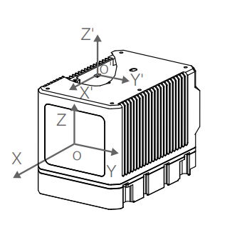

  # 多传感器标定与时间同步

<!-- TOC -->

- [多传感器标定与时间同步](#多传感器标定与时间同步)
  - [内置IMU的Livox激光雷达图](#内置imu的livox激光雷达图)
  - [问题1：Livox内置的IMU是否可以竖着放](#问题1livox内置的imu是否可以竖着放)
  - [问题2：Livox内置的IMU是否需要自己标定](#问题2livox内置的imu是否需要自己标定)
  - [问题3：如果不要用内置IMU，外置IMU如何标定](#问题3如果不要用内置imu外置imu如何标定)
  - [问题4：如何进行时间同步](#问题4如何进行时间同步)

<!-- /TOC -->

## 内置IMU的Livox激光雷达图

- AVIA 型号：

- Horizon型号

- Tele-15型号

## 问题1：Livox内置的IMU是否可以竖着放

这个问题可以认为是Livox内置的IMU竖着放时，是否可以消除重力干扰，根据这个问答，可以得出是可以消除重力干扰的结论，问答内容如下。

>问题1：为什么Horizon激光雷达内置的IMU的Z轴线性加速度在静止的情况下也为1？

>答1：z轴朝上为正，单位：g；由于重力作用，雷达受到一个朝上的反向支撑力，即加速度为1个g，因此acc_z的值为1。

>问2：加速度单位不是m/s^2? 而且也就是说在IMU输出时是没有抵消重力的

>答2：是的，可以这样理解，所以正常静止的就是1个g。

>问3：那我如果是使用的话，应该怎么根据这三个值去抵消重力呢？

问答来自[Livox官方论坛 - Horizon中IMU数据问题](https://forum.livoxtech.com/forum.php?mod=viewthread&tid=86&highlight=IMU)

>问题2：Horizon中自带的IMU静止时IMU的线性加速度为0 0 1，如何通过这个计算初始角度并以此消除重力影响呢？

>答：IMU静置时会有1g的重力加速度，通过线性加速的XYZ数值可以计算出安置角度的。
设备风扇朝下平放时会是0,0,1，此情况下可直接减1，以抵消重力加速度。

问答来自[Livox官方论坛 - Horizon中如何使用IMU解析初始角度和消除重力影响？](https://forum.livoxtech.com/forum.php?mod=viewthread&tid=143&highlight=IMU)

从这里可以说明，Livox可能给出来的是IMU原始的数据，没有去掉干扰的数据，因此会需要我们自己对IMU进行内参标定。

IMU内参标定，可参考链接：
- [关于imu内参标定(确定性与不确定性)那些事 - donghq的文章 - 知乎](https://zhuanlan.zhihu.com/p/637489769)
- [IMU内参标定](https://blog.csdn.net/weixin_49024732/article/details/124757088)
- [对Livox_avia内置IMU-BMI088进行内参标定](https://blog.csdn.net/m0_61812914/article/details/129158194)
- [利用 imu_utils 标定 imu](https://blog.csdn.net/er_dan_love/article/details/124370788)
- [Livox的点云属性与惯性坐标系](https://livox-wiki-cn.readthedocs.io/zh_CN/latest/introduction/Point_Cloud_Characteristics_and_Coordinate_System%20.html)

## 问题2：Livox内置的IMU是否需要自己标定

需要自己标定，见上面 [问题1：Livox内置的IMU是否可以竖着放](#问题1livox内置的imu是否可以竖着放)，当正常平放的时候，大概只需要减去一个重力加速度即可。

## 问题3：如果不要用内置IMU，外置IMU如何标定

根据问题1-2，外置IMU同样需要标定，标定IMU内参的方式可参考问题1中，IMU内参标定的参考链接。

外参标定，可参考：
- [用lidar_imu_init对livox_avia进行lidar和imu的外参标定](https://blog.csdn.net/m0_61812914/article/details/129771156)
- [官方开源资料汇总](https://livox-wiki-cn.readthedocs.io/zh_CN/latest/data_summary/Livox_data_summary.html#livox-mid)
- [请问雷达和IMu的标定工具有哪些？ - 自动驾驶之心的回答 - 知乎](https://www.zhihu.com/question/413393533/answer/3016104700)
- [激光雷达和IMU联合标定并运行LIOSAM](激光雷达和IMU联合标定并运行LIOSAM)
- [激光雷达与惯性测量单元标定Lidar和IMU的标定lidar_IMU_calib](https://www.cnblogs.com/chenlinchong/p/14048969.html)
- [【学习总结】Lidar与IMU标定](https://blog.csdn.net/tfb760/article/details/108532974)
- [lidar_imu_init对livox_avia进行lidar和imu的外参标定](https://blog.csdn.net/m0_61812914/article/details/128976805)
- [激光雷达和IMU联合标定并运行LIOSAM](https://blog.csdn.net/cyx610481953/article/details/115265585)
- [Calibrate extrinsic and display under ros cn](https://github.com/Livox-SDK/Livox-SDK/wiki/Calibrate-extrinsic-and-display-under-ros-cn)
- [Home - Livox-SDK/Livox-SDK](https://github.com/Livox-SDK/Livox-SDK/wiki)
- [livox_camera_lidar_calibration学习--相机内参标定](https://blog.csdn.net/qq_38650944/article/details/124120612)
- [相机雷达标定文档](https://github.com/Livox-SDK/livox_camera_lidar_calibration/blob/master/doc_resources/README_cn.md)
- [常见问题](https://www.livoxtech.com/cn/avia/faq)

## 问题4：如何进行时间同步

时间同步步骤：

- 保证时钟源一致
  - 毫秒级同步： 多采用NTP服务的方式，一般服务器和电脑就是这么同步的。
  - 纳秒级同步：多采用统一时钟源的方式，而统一时钟源中，又多用GNSS时间对齐。（或者可以直接用GNSS接收机对齐时间）
- 获取同一时刻信息（可能会索引前后两帧数据进行插值）

个人的理解是以一个固定周期为基准，（可以是一个传感器周期作为基准），获取各个传感器数据，可以每次取最新的数据，也可以取周期时间点前后两帧做插值，如下图所示：

参考链接：

- [从零开始做自动驾驶定位(六): 传感器时间同步 - 任乾的文章 - 知乎](https://zhuanlan.zhihu.com/p/108853312)
- [新手入门系列4——MEMS IMU原始数据采集和时间同步的那些坑](http://www.i2nav.cn/index/newListDetail_zw?newskind_id=13a8654e060c40c69e5f3d4c13069078&newsinfo_id=2e05f5cdac6b4725b8bfe54a689c7add)
- [雷达与IMU时间同步应该怎么做？](https://github.com/YushengWHU/HS-LiDAR-dataset/issues/1)
- [关于LiDAR的时间同步 - lyf的文章 - 知乎](https://zhuanlan.zhihu.com/p/411297400e)
