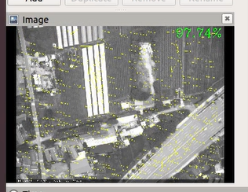

# 模拟SLAM过程（基于OpenREALM环境）

- [模拟SLAM过程（基于OpenREALM环境）](#模拟slam过程基于openrealm环境)
  - [一、任务：](#一任务)
    - [1.1、任务一：模拟单飞行器定位建图过程](#11任务一模拟单飞行器定位建图过程)
    - [1.2、任务二：模拟多飞行器定位建图过程](#12任务二模拟多飞行器定位建图过程)
  - [二、实现](#二实现)
    - [2.1、添加ROS节点](#21添加ros节点)
      - [2.1.1、添加节点cpp](#211添加节点cpp)
      - [2.1.2、配置CMakeList.txt](#212配置cmakelisttxt)
      - [2.1.3、编译与运行](#213编译与运行)
    - [2.2、代码实现](#22代码实现)
      - [2.2.1、加载地图图像](#221加载地图图像)
      - [2.2.2、随机误差](#222随机误差)
      - [2.2.3、可视化](#223可视化)
      - [2.2.4、数据保存与加载](#224数据保存与加载)
    - [2.3、图像中显示随机百分比](#23图像中显示随机百分比)
    - [2.3.1、查找到对应发布图像的代码位置过程](#231查找到对应发布图像的代码位置过程)
      - [2.3.2、随机95.0-99.99的数](#232随机950-9999的数)
      - [2.3.3、显示在图像上](#233显示在图像上)
  - [三、源代码](#三源代码)
    - [3.1、`OpenREALM_ROS1_Bridge/realm_ros/src/simulate_main.cpp`](#31openrealm_ros1_bridgerealm_rossrcsimulate_maincpp)
    - [3.2、`src/OpenREALM_ROS1_Bridge/realm_ros/launch/simulate.launch`](#32srcopenrealm_ros1_bridgerealm_roslaunchsimulatelaunch)
    - [3.3、`OpenREALM_ROS1_Bridge/realm_ros/src/realm_ros_lib/stage_node.cpp`](#33openrealm_ros1_bridgerealm_rossrcrealm_ros_libstage_nodecpp)


## 一、任务：

任务主要分为单飞行器与多飞行器两种情况，主要包括：可视化模拟GPS、IMU惯性SLAM、视觉+惯性SLAM、视觉+惯性SLAM+回环检测的路径。

### 1.1、任务一：模拟单飞行器定位建图过程

模拟过程如下视频所示，其中蓝色线是GPS路径，红色线是视觉+惯导SLAM定位的路径，黄色线是惯导SLAM定位的路径，最后的绿色线是视觉+惯导SLAM，经过回环检测之后定位的路径；视觉+惯导SLAM优于惯导SLAM定位效果，经过回环检测之后，视觉+惯导SLAM定位效果有一定的优化，更加接近于GPS路径。


### 1.2、任务二：模拟多飞行器定位建图过程

模拟过程如下视频所示，与任务一不同的时，两个飞行器从左上角开始，一个先往左下飞，再往右飞，一个先向右飞，再往左下飞，在地图右下角汇合，进行回环检测。


## 二、实现

### 2.1、添加ROS节点

由于目标环境没有网络，而目标电脑设备上已经配置了OpenREALM环境(包含了OpenCV、C++等环境配置)，因此这里通过在OpenREALM添加新的节点来实现。

#### 2.1.1、添加节点cpp

在`OpenREALM_ROS1_Bridge/realm_ros/src`文件夹创建包含`main`函数的`cpp`源文件。

```c++
#include <iostream>
#include <ros/ros.h>

int main(int argc, char **argv)
{

  ros::init(argc, argv, "simulate");
  printf("hello, world!\n");

//   ros::Rate rate(100);
//   while (node.isOkay())
//   {
//     ros::spinOnce();
//     node.spin();
//     rate.sleep();
//   }
  ros::shutdown();
  return 0;
}
```

#### 2.1.2、配置CMakeList.txt

在`OpenREALM_ROS1_Bridge/realm_ros/CMakeLists.txt`文件中添加执行文件`cpp`源文件以及链接的库。

```cmakelist
add_executable(simulate src/simulate_main.cpp)
target_link_libraries(simulate PUBLIC ${PROJECT_NAME})
```

#### 2.1.3、编译与运行

回到ros工作路径`catkin_ws`（`catkin_ws/src/OpenREALM_ROS1_Bridge`）

```bash
cd ~\catkin_ws

catkin_make
```

`rosrun`运行，需要开启两个终端，一个终端运行`roscore`，另一个运行模拟节点。`rosrun`带有参数的格式：`rosrun package node _parameter:=value`。

- 终端一

```bash
roscore
```

- 终端二

```bash
rosrun realm_ros simulate _strInputImagePath:=/home/bingqiangzhou/catkin_ws/src/OpenREALM_ROS1_Bridge/realm_ros/src/dom.jpg _bShowRestructMap:=false _strDataPathForSingle:=/home/bingqiangzhou/catkin_ws/src/OpenREALM_ROS1_Bridge/realm_ros/src/data2.txt _strDataPathForMutli:=/home/bingqiangzhou/catkin_ws/src/OpenREALM_ROS1_Bridge/realm_ros/src/datam.txt
```

`roslaunch`运行，`simulate.launch`请查看[3.2、`src/OpenREALM_ROS1_Bridge/realm_ros/launch/simulate.launch`](#32srcopenrealm_ros1_bridgerealm_roslaunchsimulatelaunch)

```bash
roslaunch realm_ros simulate.launch
```

参考链接：
- [ROS向节点传递参数的几种方式](https://blog.csdn.net/Spacegene/article/details/107655017)
- [【ROS学习】ROS param 的使用](https://blog.csdn.net/qq_39779233/article/details/108411778)

### 2.2、代码实现

#### 2.2.1、加载地图图像

将地图根据合适的屏幕显示高宽来计算resize比例，保证imshow显示图像不超过屏幕区域。

```C++
Mat GetShowImgAdjust(Mat matImg, double &dShowImgRatio, int nFixWidth, int nFixHeight){
  // 计算合适的显示大小
  dShowImgRatio = 1.0;
  int w = matImg.cols, h = matImg.rows;
  printf("source image size(w, h): (%d, %d)\n", w, h);
  if(w > h){
      //c 宽大于高，按宽为1200计算比例
      dShowImgRatio = nFixWidth * 1.0 / w;
  }
  else{
      // 高大于宽，按高为800计算比例
      dShowImgRatio = nFixHeight * 1.0 / h;
  }
  printf("show image ratio: %f\n", dShowImgRatio);
  Mat matShowImg;
  cv::resize(matImg, matShowImg, cv::Size(0, 0), dShowImgRatio, dShowImgRatio);
  printf("show image size(w, h): (%d, %d)\n", matShowImg.cols, matShowImg.rows);
  return matShowImg;
}
```

#### 2.2.2、随机误差

根据与上一个数据，判断是x坐标在变化还是y坐标在变化；x在变化时，随机y坐标的误差；y在变化时，随机x坐标的误差。

```c++
int GetRandNumber(int minValue, int maxValue){
  srand(time(nullptr)); // 用当前时间作为种子
  int randomValue = (rand() % int(maxValue - minValue)) + minValue + 1;//范围(min,max]
  return randomValue;
}

double nRandRangeForImu = 0.2;
double dRandSumXForImu = 0, dRandSumYForImu = 0;
double nRandRangeForImuView = 0.4;
double dRandSumXForImuView = 0, dRandSumYForImuView = 0;
double nRandRangeForloopClosure = 0.2;
double dRandSumXForloopClosure = 0, dRandSumYForloopClosure = 0;

// 由上一点和这一个点，判断随机x还是随机y
int nLastPtIndex = (i - 1 + vecPts.size()) % vecPts.size();
bool bRandSign = 1;
if(vecPts[i].x - vecPts[nLastPtIndex].x != 0){
    // printf("%d, %d; %d, %d; 1 %d\n", i, nLastPtIndex, vecPts[i].x, vecPts[nLastPtIndex].x, bRandSign);
    dRandSumYForImu += bRandSign * (GetRandNumber(0, nRandRangeForImu * 100) / 100.0);
    dRandSumYForImuView  += bRandSign * (GetRandNumber(0, nRandRangeForImuView * 100) / 100.0 - nRandRangeForImuView/2);
    dRandSumYForloopClosure += (GetRandNumber(0, nRandRangeForloopClosure * 100) / 100.0 - nRandRangeForloopClosure/2);
}
else{
    // printf("%d, %d; %d, %d; 1 %d\n", i, nLastPtIndex, vecPts[i].x, vecPts[nLastPtIndex].x, bRandSign);
    dRandSumXForImu += bRandSign * (GetRandNumber(0, nRandRangeForImu * 100) / 100.0);
    dRandSumXForImuView  += bRandSign * (GetRandNumber(0, nRandRangeForImuView * 100) / 100.0 - nRandRangeForImuView/2);
    dRandSumXForloopClosure += (GetRandNumber(0, nRandRangeForloopClosure * 100) / 100.0 - nRandRangeForloopClosure/2);
}
vecPtsForImu[i] = vecPts[i] + Point(dRandSumXForImu, dRandSumYForImu);
vecPtsForImuView[i] = vecPts[i] + Point(dRandSumXForImuView, dRandSumYForImuView);
vecPtsForLoopClosure[i] = vecPts[i] + Point(dRandSumXForloopClosure, dRandSumYForloopClosure);
```

#### 2.2.3、可视化

每50ms刷新一次`imshow`。

```c++
// 画出航线
for (int j = 0; j <= i; j++){
    circle(matShowImgTemp, vecPtsForImu[j], 1, Scalar(0, 255, 255)); // 显示航线
    circle(matShowImgTemp, vecPtsForImuView[j], 1, Scalar(0, 0, 255)); // 显示航线
    circle(matShowImgTemp, vecPts[j], 1, Scalar(255, 0, 0)); // 显示GPS航线
}

//显示中间结果
// rectangle(matShowImg, rectLoadImg, Scalar(0, 255, 0));
imshow("img", matShowImgTemp);
// imshow("gray", matMergeGray);
char c = waitKey(50);
if(c == 'c' || c == 'C'){
    destroyAllWindows();
    return 0;
}
```

#### 2.2.4、数据保存与加载

数据保存

```c++
ofstream ofs(strDataPath, ios::out | ios::binary);
if (!ofs.is_open()){
    destroyAllWindows();
    return 0;
}
ofs << int(vecPts.size()) << endl;
for (int j = 0; j < vecPts.size(); j++){
    ofs <<  vecPts[j].x << " " <<  vecPts[j].y << endl;
}
for (int j = 0; j < vecPts.size(); j++){
    ofs <<  vecPtsForImu[j].x << " " <<  vecPtsForImu[j].y << endl;
}
for (int j = 0; j < vecPts.size(); j++){
    ofs <<  vecPtsForImuView[j].x  << " " <<  vecPtsForImuView[j].y << endl;
}
for (int j = 0; j < vecPts.size(); j++){
    ofs <<  vecPtsForLoopClosure[j].x << " " <<  vecPtsForLoopClosure[j].y << endl;
}
ofs.close();
```


数据读取

```c++
ifs.open(strDataPath, ios::in | ios::binary);
if (!ifs.is_open()){
    return 0;
}
int nPtNum = 0;
ifs >> nPtNum;
printf("nPtNum %d\n", nPtNum);
vecPts.resize(nPtNum);
for (int j = 0; j < nPtNum; j++){
    ifs >>  vecPts[j].x >> vecPts[j].y;
    // printf("%d, %d\n", vecPts[j].x, vecPts[j].y);
}
vecPtsForImu.resize(nPtNum);
for (int j = 0; j < nPtNum; j++){
    ifs >>  vecPtsForImu[j].x >>  vecPtsForImu[j].y;
    // printf("%d, %d\n", vecPtsForImu[j].x, vecPtsForImu[j].y);

}
vecPtsForImuView.resize(nPtNum);
for (int j = 0; j < nPtNum; j++){
    ifs >>  vecPtsForImuView[j].x >>  vecPtsForImuView[j].y;
    // printf("%d, %d\n", vecPtsForImuView[j].x, vecPtsForImuView[j].y);

}
vecPtsForLoopClosure.resize(nPtNum);
for (int j = 0; j < nPtNum; j++){
    ifs >>  vecPtsForLoopClosure[j].x >>  vecPtsForLoopClosure[j].y;
    // printf("%d, %d\n", vecPtsForLoopClosure[j].x, vecPtsForLoopClosure[j].y);

}
ifs.close();
```

### 2.3、图像中显示随机百分比

在`rviz`的`image`中显示随机百分比，效果如下图所示。



### 2.3.1、查找到对应发布图像的代码位置过程

通过`roslaunch realm_ros alexa_noreco.launch`运行`OpenREALM`，在`rviz`中查看`image`话题的发布者`/realm/alexa/pose_estimation/tracked`，搜索未找到有用信息。

搜索`advertise`，找到`realm_ros/src/realm_ros_lib/stage_node.cpp`文件中`_nh.advertiseService`，154行
`_publisher.insert({"debug/tracked", _nh.advertise<sensor_msgs::Image>(_topic_prefix + "tracked", 5)});`，在`realm_ros/src/realm_ros_lib/stage_node.cpp`文件中搜索`sensor_msgs::Image`，在` StageNode::pubImage()`函数中找到发布图像的位置，添加相关功能代码。


#### 2.3.2、随机95.0-99.99的数

```c++
// 在95%~99.9%之间取随机数，保留2位小数
srand(time(nullptr)); // 用当前时间作为种子
double n = 2; //保留2位小数
double m = pow(10, n);
double min = 95*m, max = 99.999999*m;
double randomValue = (rand() % int(max - min)) + min + 1;//范围(min,max]
double ratio = randomValue / m;
```

#### 2.3.3、显示在图像上

```c++
std::string text = std::to_string(ratio);
text = text.substr(0, text.find(".") + n + 1) + "%"; // //保留2位小数
int font_face = cv::FONT_HERSHEY_COMPLEX; 
double font_scale = 2;
int thickness = 2;
int baseline;
//获取文本框的长宽
cv::Size text_size = cv::getTextSize(text, font_face, font_scale, thickness, &baseline);

//右上角显示text
cv::Point origin; 
origin.x = img.cols - text_size.width - 10; // 右上角显示text
origin.y = text_size.height + 10;
cv::putText(img, text, origin, font_face, font_scale, cv::Scalar(0, 255, 0), thickness, 8, 0);
```


## 三、源代码

### 3.1、`OpenREALM_ROS1_Bridge/realm_ros/src/simulate_main.cpp`

```c++
#include <iostream>
#include <fstream>

#include <ros/ros.h>
#include <exception>
#include <vector>
#include <cstdlib>
#include <ctime>
#include <opencv2/opencv.hpp>

using namespace cv;
using namespace std;

#pragma region 函数声明

Mat GetShowImgAdjust(Mat matImg, double &dShowImgRatio,  int nFixWidth=1200, int nFixHeight=800);

vector<Point> GetRectPoints(Mat matImg, double nDownSizeFactor=0.1);

int GetRandNumber(int minValue=0, int maxValue=50);

Mat ColorMat2Gray(Mat matImg);


int Simulate1(){
  ros::NodeHandle nh; // 需要注意局部与全局的区别  https://blog.csdn.net/qq_39779233/article/details/108411778
   // bool bLoadData = false;
  bool bLoadData = true;
  
#pragma region 获取输入图像路径
  std::string strInputImgPath;
  std::string strDataPath;
  ifstream ifs;
  if(nh.getParam("simulate/strDataPath", strDataPath)){
    ifs.open(strDataPath);
    if(ifs.is_open()){
      // bLoadData = true;
      ifs.close();
      ROS_INFO("input data path: %s", strDataPath.c_str());
    }
  }
  if(nh.getParam("simulate/strInputImagePath", strInputImgPath)){
    // ROS_INFO("input image path: %s", strInputImgPath.c_str());
  }
  else{
    ROS_ERROR("didn't find parameter `strInputImagePath`");
    return -1;
  }
  bool bShowRestructMap;
  nh.param<bool>("simulate/bShowRestructMap", bShowRestructMap, false);
#pragma endregion
 
#pragma region 读取图像 
  Mat matImg = cv::imread(strInputImgPath.c_str());
  if(matImg.empty()){
    printf("img is empty\n");
    return -2;
  }
#pragma endregion

  double dShowImgRatio;
  double nDownSizeFactor=0.2;
  Mat matImgAdjust = GetShowImgAdjust(matImg, dShowImgRatio);
  Mat matShowImg = matImgAdjust.clone();
  //printf("pt num %d\n", matShowImg.cols);
  vector<Point> vecPts = GetRectPoints(matShowImg);
  //printf("pt num %d\n", vecPts.size());
  vector<Point> vecPtsForImu(vecPts.size()); // 惯性
  vector<Point> vecPtsForImuView(vecPts.size()); // 视觉+惯性
  vector<Point> vecPtsForLoopClosure(vecPts.size()); // 回环检测
  
  printf("open data, %d\n", bLoadData);
  if (bLoadData){
    ifs.open(strDataPath, ios::in | ios::binary);
    if (!ifs.is_open()){
      return 0;
    }
    int nPtNum = 0;
    ifs >> nPtNum;
    printf("nPtNum %d\n", nPtNum);
    vecPts.resize(nPtNum);
    for (int j = 0; j < nPtNum; j++){
      ifs >>  vecPts[j].x >> vecPts[j].y;
      // printf("%d, %d\n", vecPts[j].x, vecPts[j].y);
    }
    vecPtsForImu.resize(nPtNum);
    for (int j = 0; j < nPtNum; j++){
      ifs >>  vecPtsForImu[j].x >>  vecPtsForImu[j].y;
      // printf("%d, %d\n", vecPtsForImu[j].x, vecPtsForImu[j].y);

    }
    vecPtsForImuView.resize(nPtNum);
    for (int j = 0; j < nPtNum; j++){
      ifs >>  vecPtsForImuView[j].x >>  vecPtsForImuView[j].y;
      // printf("%d, %d\n", vecPtsForImuView[j].x, vecPtsForImuView[j].y);

    }
    vecPtsForLoopClosure.resize(nPtNum);
    for (int j = 0; j < nPtNum; j++){
      ifs >>  vecPtsForLoopClosure[j].x >>  vecPtsForLoopClosure[j].y;
      // printf("%d, %d\n", vecPtsForLoopClosure[j].x, vecPtsForLoopClosure[j].y);

    }
    ifs.close();
  }


  Mat matShowRestructMap;
  if(bShowRestructMap){
    matShowRestructMap = Mat(matShowImg.size(), CV_8UC3, Scalar(255, 255, 255));
  }

  double nRandRangeForImu = 0.2;
  double dRandSumXForImu = 0, dRandSumYForImu = 0;
  double nRandRangeForImuView = 0.4;
  double dRandSumXForImuView = 0, dRandSumYForImuView = 0;
  double nRandRangeForloopClosure = 0.2;
  double dRandSumXForloopClosure = 0, dRandSumYForloopClosure = 0;
  int nRectHeightWidth = MAX(matImg.cols, matImg.rows) * nDownSizeFactor / 4 * dShowImgRatio;
  int nRandHeight = 0, nRandWidth = 0;
  for (int i = 0; i < vecPts.size(); i++){

    // 计算加上随机性的高宽
    int nRandWidth =  nRectHeightWidth + GetRandNumber(0, MAX(nRectHeightWidth * 0.5 * 5, 5)) / 5;
    int nRandHeight = nRectHeightWidth + GetRandNumber(0, MAX(nRectHeightWidth * 0.5 * 5, 5)) / 5;
    // printf("%d, %d; %d, %d\n", vecPts[i].x, vecPts[i].y,  nRandWidth, nRandWidth);
    Rect rectLoadImg(vecPts[i].x - nRandWidth / 2, vecPts[i].y - nRandHeight / 2, nRandWidth, nRandHeight);
    //printf("%d, %d, %d, %d\n", rectLoadImg.x, rectLoadImg.y, rectLoadImg.width, rectLoadImg.height);
   
    // 提取附近图像
    Mat matLoadImg = matImgAdjust(rectLoadImg).clone();
    // 将rgb图转为灰度图，再合并为3通道的图，代替大图位置的彩色图
    Mat matMergeGray = ColorMat2Gray(matLoadImg);
    matMergeGray.copyTo(matShowImg(rectLoadImg));

    if (!bLoadData){
      // 由上一点和这一个点，判断随机x还是随机y
      int nLastPtIndex = (i - 1 + vecPts.size()) % vecPts.size();
      bool bRandSign = 1;
      if(vecPts[i].x - vecPts[nLastPtIndex].x != 0){
        // printf("%d, %d; %d, %d; 1 %d\n", i, nLastPtIndex, vecPts[i].x, vecPts[nLastPtIndex].x, bRandSign);
        dRandSumYForImu += bRandSign * (GetRandNumber(0, nRandRangeForImu * 100) / 100.0);
        dRandSumYForImuView  += bRandSign * (GetRandNumber(0, nRandRangeForImuView * 100) / 100.0 - nRandRangeForImuView/2);
        dRandSumYForloopClosure += (GetRandNumber(0, nRandRangeForloopClosure * 100) / 100.0 - nRandRangeForloopClosure/2);
      }
      else{
        // printf("%d, %d; %d, %d; 1 %d\n", i, nLastPtIndex, vecPts[i].x, vecPts[nLastPtIndex].x, bRandSign);
        dRandSumXForImu += bRandSign * (GetRandNumber(0, nRandRangeForImu * 100) / 100.0);
        dRandSumXForImuView  += bRandSign * (GetRandNumber(0, nRandRangeForImuView * 100) / 100.0 - nRandRangeForImuView/2);
        dRandSumXForloopClosure += (GetRandNumber(0, nRandRangeForloopClosure * 100) / 100.0 - nRandRangeForloopClosure/2);
      }
      vecPtsForImu[i] = vecPts[i] + Point(dRandSumXForImu, dRandSumYForImu);
      vecPtsForImuView[i] = vecPts[i] + Point(dRandSumXForImuView, dRandSumYForImuView);
      vecPtsForLoopClosure[i] = vecPts[i] + Point(dRandSumXForloopClosure, dRandSumYForloopClosure);
    }

    Mat matShowImgTemp = matShowImg.clone();
    // 画出航线
    for (int j = 0; j <= i; j++){
      circle(matShowImgTemp, vecPtsForImu[j], 1, Scalar(0, 255, 255)); // 显示航线
      circle(matShowImgTemp, vecPtsForImuView[j], 1, Scalar(0, 0, 255)); // 显示航线
      circle(matShowImgTemp, vecPts[j], 1, Scalar(255, 0, 0)); // 显示GPS航线
    }

    if(bShowRestructMap){
      matMergeGray.copyTo(matShowRestructMap(rectLoadImg));
      imshow("RestructMap", matShowRestructMap);
    }

    //显示中间结果
    // rectangle(matShowImg, rectLoadImg, Scalar(0, 255, 0));
    imshow("img", matShowImgTemp);
    // imshow("gray", matMergeGray);
    char c = waitKey(50);
    if(c == 'c' || c == 'C'){
      destroyAllWindows();
      return 0;
    }

  }
  printf("loop closure...\n");
  sleep(0.2);
  for (int j = 0; j < vecPts.size(); j++){
    circle(matShowImg, vecPtsForImu[j], 1, Scalar(0, 255, 255)); // 显示航线
    circle(matShowImg, vecPts[j], 1, Scalar(255, 0, 0)); // 显示GPS航线
    circle(matShowImg, vecPtsForLoopClosure[j], 1, Scalar(0, 255, 0)); // 显示GPS航线
  }
  line(matShowImg, vecPtsForLoopClosure[vecPts.size() - 1], vecPtsForLoopClosure[0], Scalar(0, 255, 0), 2);

  // 保存数据
  if (!bLoadData){
    ofstream ofs(strDataPath, ios::out | ios::binary);
    if (!ofs.is_open()){
      destroyAllWindows();
      return 0;
    }
    ofs << int(vecPts.size()) << endl;
    for (int j = 0; j < vecPts.size(); j++){
      ofs <<  vecPts[j].x << " " <<  vecPts[j].y << endl;
    }
    for (int j = 0; j < vecPts.size(); j++){
      ofs <<  vecPtsForImu[j].x << " " <<  vecPtsForImu[j].y << endl;
    }
    for (int j = 0; j < vecPts.size(); j++){
      ofs <<  vecPtsForImuView[j].x  << " " <<  vecPtsForImuView[j].y << endl;
    }
    for (int j = 0; j < vecPts.size(); j++){
      ofs <<  vecPtsForLoopClosure[j].x << " " <<  vecPtsForLoopClosure[j].y << endl;
    }
    ofs.close();
  }
  printf("data saved.\n");
  imshow("img", matShowImg);
  waitKey(0);
  destroyAllWindows();
}

int Simulate2(){
  ros::NodeHandle nh; // 需要注意局部与全局的区别  https://blog.csdn.net/qq_39779233/article/details/108411778
  //  bool bLoadData = false;
  bool bLoadData = true;
  
#pragma region 获取输入图像路径
  std::string strInputImgPath;
  std::string strDataPath;
  ifstream ifs;
  if(nh.getParam("simulate/strDataPathForMutli", strDataPath)){
    ifs.open(strDataPath);
    if(ifs.is_open()){
      // bLoadData = true;
      ifs.close();
      ROS_INFO("input data path: %s", strDataPath.c_str());
    }
  }
  if(nh.getParam("simulate/strInputImagePath", strInputImgPath)){
    // ROS_INFO("input image path: %s", strInputImgPath.c_str());
  }
  else{
    ROS_ERROR("didn't find parameter `strInputImagePath`");
    return -1;
  }
  // bool bShowRestructMap;
  // nh.param<bool>("simulate/bShowRestructMap", bShowRestructMap, false);
#pragma endregion
 
#pragma region 读取图像 
  Mat matImg = cv::imread(strInputImgPath.c_str());
  if(matImg.empty()){
    printf("img is empty\n");
    return -2;
  }
#pragma endregion

  double dShowImgRatio;
  double nDownSizeFactor=0.2;
  Mat matImgAdjust = GetShowImgAdjust(matImg, dShowImgRatio);
  Mat matShowImg = matImgAdjust.clone();
  //printf("pt num %d\n", matShowImg.cols);
  vector<Point> vecPts = GetRectPoints(matShowImg);  
  //printf("pt num %d\n", vecPts.size());
  vector<Point> vecPtsForImu(vecPts.size()); // 惯性
  vector<Point> vecPtsForImuView(vecPts.size()); // 视觉+惯性
  vector<Point> vecPtsForLoopClosure(vecPts.size()); // 回环检测
  
  printf("open data, %d\n", bLoadData);
  if (bLoadData){
    ifs.open(strDataPath, ios::in | ios::binary);
    if (!ifs.is_open()){
      return 0;
    }
    int nPtNum = 0;
    ifs >> nPtNum;
    printf("nPtNum %d\n", nPtNum);
    vecPts.resize(nPtNum);
    for (int j = 0; j < nPtNum; j++){
      ifs >>  vecPts[j].x >> vecPts[j].y;
      // printf("%d, %d\n", vecPts[j].x, vecPts[j].y);
    }
    vecPtsForImu.resize(nPtNum);
    for (int j = 0; j < nPtNum; j++){
      ifs >>  vecPtsForImu[j].x >>  vecPtsForImu[j].y;
      // printf("%d, %d\n", vecPtsForImu[j].x, vecPtsForImu[j].y);

    }
    vecPtsForImuView.resize(nPtNum);
    for (int j = 0; j < nPtNum; j++){
      ifs >>  vecPtsForImuView[j].x >>  vecPtsForImuView[j].y;
      // printf("%d, %d\n", vecPtsForImuView[j].x, vecPtsForImuView[j].y);

    }
    vecPtsForLoopClosure.resize(nPtNum);
    for (int j = 0; j < nPtNum; j++){
      ifs >>  vecPtsForLoopClosure[j].x >>  vecPtsForLoopClosure[j].y;
      // printf("%d, %d\n", vecPtsForLoopClosure[j].x, vecPtsForLoopClosure[j].y);

    }
    ifs.close();
  }

  double nRandRangeForImu = 0.2;
  double dRandSumXForImu = 0, dRandSumYForImu = 0;
  double nRandRangeForImuView = 0.4;
  double dRandSumXForImuView = 0, dRandSumYForImuView = 0;
  double nRandRangeForloopClosure = 0.2;
  double dRandSumXForloopClosure = 0, dRandSumYForloopClosure = 0;
  int nRectHeightWidth = MAX(matImg.cols, matImg.rows) * nDownSizeFactor / 4 * dShowImgRatio;
  int nRandHeight = 0, nRandWidth = 0;
  for (int i = 0; i < vecPts.size() / 2; i++){

    int nIndex1 = i;
    int nIndex2 = vecPts.size() - i - 1;
    Point pt1 = vecPts[i];
    Point pt2 = vecPts[vecPts.size() - i - 1];

    // 计算加上随机性的高宽
    int nRandWidth =  nRectHeightWidth + GetRandNumber(0, MAX(nRectHeightWidth * 0.5 * 5, 5)) / 5;
    int nRandHeight = nRectHeightWidth + GetRandNumber(0, MAX(nRectHeightWidth * 0.5 * 5, 5)) / 5;
    // printf("%d, %d; %d, %d\n", vecPts[i].x, vecPts[i].y,  nRandWidth, nRandWidth);
    Rect rectLoadImg1(pt1.x - nRandWidth / 2, pt1.y - nRandHeight / 2, nRandWidth, nRandHeight);
    //printf("%d, %d, %d, %d\n", rectLoadImg.x, rectLoadImg.y, rectLoadImg.width, rectLoadImg.height);
   
    // 提取附近图像
    Mat matLoadImg1 = matImgAdjust(rectLoadImg1).clone();
    // 将rgb图转为灰度图，再合并为3通道的图，代替大图位置的彩色图
    Mat matMergeGray1 = ColorMat2Gray(matLoadImg1);
    matMergeGray1.copyTo(matShowImg(rectLoadImg1));

    // 计算加上随机性的高宽
    nRandWidth =  nRectHeightWidth + GetRandNumber(0, MAX(nRectHeightWidth * 0.5 * 5, 5)) / 5;
    nRandHeight = nRectHeightWidth + GetRandNumber(0, MAX(nRectHeightWidth * 0.5 * 5, 5)) / 5;
    // printf("%d, %d; %d, %d\n", vecPts[i].x, vecPts[i].y,  nRandWidth, nRandWidth);
    Rect rectLoadImg2(pt2.x - nRandWidth / 2, pt2.y - nRandHeight / 2, nRandWidth, nRandHeight);
    //printf("%d, %d, %d, %d\n", rectLoadImg.x, rectLoadImg.y, rectLoadImg.width, rectLoadImg.height);
   
    // 提取附近图像
    Mat matLoadImg2 = matImgAdjust(rectLoadImg2).clone();
    // 将rgb图转为灰度图，再合并为3通道的图，代替大图位置的彩色图
    Mat matMergeGray2 = ColorMat2Gray(matLoadImg2);
    matMergeGray2.copyTo(matShowImg(rectLoadImg2));

    if (!bLoadData){
      // 由上一点和这一个点，判断随机x还是随机y
      int nLastPtIndex = (nIndex1 - 1 + vecPts.size()) % vecPts.size();
      if(vecPts[nIndex1].x - vecPts[nLastPtIndex].x != 0){
        // printf("%d, %d; %d, %d; 1 %d\n", i, nLastPtIndex, vecPts[i].x, vecPts[nLastPtIndex].x, bRandSign);
        dRandSumYForImu += (GetRandNumber(0, nRandRangeForImu * 100) / 100.0);
        dRandSumYForImuView  += (GetRandNumber(0, nRandRangeForImuView * 100) / 100.0 - nRandRangeForImuView/2);
        dRandSumYForloopClosure += (GetRandNumber(0, nRandRangeForloopClosure * 100) / 100.0 - nRandRangeForloopClosure/2);
      }
      else{
        // printf("%d, %d; %d, %d; 1 %d\n", i, nLastPtIndex, vecPts[i].x, vecPts[nLastPtIndex].x, bRandSign);
        dRandSumXForImu += (GetRandNumber(0, nRandRangeForImu * 100) / 100.0);
        dRandSumXForImuView  += (GetRandNumber(0, nRandRangeForImuView * 100) / 100.0 - nRandRangeForImuView/2);
        dRandSumXForloopClosure += (GetRandNumber(0, nRandRangeForloopClosure * 100) / 100.0 - nRandRangeForloopClosure/2);
      }
      vecPtsForImu[nIndex1] = vecPts[nIndex1] + Point(dRandSumXForImu, dRandSumYForImu);
      vecPtsForImuView[nIndex1] = vecPts[nIndex1] + Point(dRandSumXForImuView, dRandSumYForImuView);
      vecPtsForLoopClosure[nIndex1] = vecPts[nIndex1] + Point(dRandSumXForloopClosure, dRandSumYForloopClosure);

      // 由上一点和这一个点，判断随机x还是随机y
      int nLastPtIndexEnd = (nIndex2 + 1 + vecPts.size()) % vecPts.size();
      if(vecPts[nIndex2].x - vecPts[nLastPtIndex].x != 0){
        // printf("%d, %d; %d, %d; 1 %d\n", i, nLastPtIndex, vecPts[i].x, vecPts[nLastPtIndex].x, bRandSign);
        dRandSumYForImu += (GetRandNumber(0, nRandRangeForImu * 100) / 100.0);
        dRandSumYForImuView  += (GetRandNumber(0, nRandRangeForImuView * 100) / 100.0 - nRandRangeForImuView/2);
        dRandSumYForloopClosure += (GetRandNumber(0, nRandRangeForloopClosure * 100) / 100.0 - nRandRangeForloopClosure/2);
      }
      else{
        // printf("%d, %d; %d, %d; 1 %d\n", i, nLastPtIndex, vecPts[i].x, vecPts[nLastPtIndex].x, bRandSign);
        dRandSumXForImu += (GetRandNumber(0, nRandRangeForImu * 100) / 100.0);
        dRandSumXForImuView  += (GetRandNumber(0, nRandRangeForImuView * 100) / 100.0 - nRandRangeForImuView/2);
        dRandSumXForloopClosure += (GetRandNumber(0, nRandRangeForloopClosure * 100) / 100.0 - nRandRangeForloopClosure/2);
      }
      vecPtsForImu[nIndex2] = vecPts[nIndex2] + Point(dRandSumXForImu, dRandSumYForImu);
      vecPtsForImuView[nIndex2] = vecPts[nIndex2] + Point(dRandSumXForImuView, dRandSumYForImuView);
      vecPtsForLoopClosure[nIndex2] = vecPts[nIndex2] + Point(dRandSumXForloopClosure, dRandSumYForloopClosure);
    }

    Mat matShowImgTemp = matShowImg.clone();
    // 画出航线
    for (int j = 0; j <= i; j++){
      circle(matShowImgTemp, vecPtsForImu[j], 1, Scalar(0, 255, 255)); // 显示航线
      circle(matShowImgTemp, vecPtsForImuView[j], 1, Scalar(0, 0, 255)); // 显示航线
      circle(matShowImgTemp, vecPts[j], 1, Scalar(255, 0, 0)); // 显示GPS航线
    }
    // 画出航线
    for (int j = vecPts.size()-1; j >= nIndex2; j--){
      circle(matShowImgTemp, vecPtsForImu[j], 1, Scalar(0, 255, 255)); // 显示航线
      circle(matShowImgTemp, vecPtsForImuView[j], 1, Scalar(0, 0, 255)); // 显示航线
      circle(matShowImgTemp, vecPts[j], 1, Scalar(255, 0, 0)); // 显示GPS航线
    }

    //显示中间结果
    // rectangle(matShowImg, rectLoadImg, Scalar(0, 255, 0));
    imshow("img", matShowImgTemp);
    // imshow("gray", matMergeGray);
    char c = waitKey(50);
    if(c == 'c' || c == 'C'){
      destroyAllWindows();
      return 0;
    }

  }
  printf("loop closure...\n");
  sleep(0.2);
  for (int j = 0; j < vecPts.size(); j++){
    circle(matShowImg, vecPtsForImu[j], 1, Scalar(0, 255, 255)); // 显示航线
    circle(matShowImg, vecPts[j], 1, Scalar(255, 0, 0)); // 显示GPS航线
    circle(matShowImg, vecPtsForLoopClosure[j], 1, Scalar(0, 255, 0)); // 显示GPS航线
  }
  line(matShowImg, vecPtsForLoopClosure[vecPts.size() - 1], vecPtsForLoopClosure[0], Scalar(0, 255, 0), 2);

  // 保存数据
  if (!bLoadData){
    ofstream ofs(strDataPath, ios::out | ios::binary);
    if (!ofs.is_open()){
      destroyAllWindows();
      return 0;
    }
    ofs << int(vecPts.size()) << endl;
    for (int j = 0; j < vecPts.size(); j++){
      ofs <<  vecPts[j].x << " " <<  vecPts[j].y << endl;
    }
    for (int j = 0; j < vecPts.size(); j++){
      ofs <<  vecPtsForImu[j].x << " " <<  vecPtsForImu[j].y << endl;
    }
    for (int j = 0; j < vecPts.size(); j++){
      ofs <<  vecPtsForImuView[j].x  << " " <<  vecPtsForImuView[j].y << endl;
    }
    for (int j = 0; j < vecPts.size(); j++){
      ofs <<  vecPtsForLoopClosure[j].x << " " <<  vecPtsForLoopClosure[j].y << endl;
    }
    ofs.close();
  }
  printf("data saved.\n");
  imshow("img", matShowImg);
  waitKey(0);
  destroyAllWindows();
}

#pragma endregion


#pragma region 函数定义
Mat GetShowImgAdjust(Mat matImg, double &dShowImgRatio, int nFixWidth, int nFixHeight){
  // 计算合适的显示大小
  dShowImgRatio = 1.0;
  int w = matImg.cols, h = matImg.rows;
  printf("source image size(w, h): (%d, %d)\n", w, h);
  if(w > h){
      //c 宽大于高，按宽为1200计算比例
      dShowImgRatio = nFixWidth * 1.0 / w;
  }
  else{
      // 高大于宽，按高为800计算比例
      dShowImgRatio = nFixHeight * 1.0 / h;
  }
  printf("show image ratio: %f\n", dShowImgRatio);
  Mat matShowImg;
  cv::resize(matImg, matShowImg, cv::Size(0, 0), dShowImgRatio, dShowImgRatio);
  printf("show image size(w, h): (%d, %d)\n", matShowImg.cols, matShowImg.rows);
  return matShowImg;
}

vector<Point> GetRectPoints(Mat matImg, double nDownSizeFactor){
  if (nDownSizeFactor <= 0 || nDownSizeFactor >= 0.5){
    printf("nDownSizeFactor must be in range (0, 0.5)");
    throw "nDownSizeFactor must be in range (0, 0.5)";
    return vector<Point>();
  }
  
  int nDownSizeWidth = int(matImg.cols * nDownSizeFactor);
  int nDownSizeHeight = int(matImg.rows * nDownSizeFactor);
  Rect rectDownSize = Rect(nDownSizeWidth, nDownSizeHeight, matImg.cols - nDownSizeWidth * 2, matImg.rows - nDownSizeHeight * 2);

  // printf("%d, %d, %d, %d\n", rectDownSize.x, rectDownSize.y, rectDownSize.width, rectDownSize.height);

  vector<Point> vecPtList;
  vecPtList.resize(max(rectDownSize.width, rectDownSize.height) * 4);
  int nIndex = 0;
  // 左上到左下
  for (int i = rectDownSize.y; i <= rectDownSize.y + rectDownSize.height; i++, nIndex++){
    vecPtList[nIndex] = Point(rectDownSize.x, i); 
  }
  // 左下到右下
  for (int i = rectDownSize.x; i <= rectDownSize.x + rectDownSize.width; i++, nIndex++){
    vecPtList[nIndex] = Point(i, rectDownSize.y + rectDownSize.height); 
  }
  // 右下到右上
  for (int i = rectDownSize.y + rectDownSize.height; i >= rectDownSize.y; i--, nIndex++){
    vecPtList[nIndex] = Point(rectDownSize.x + rectDownSize.width, i); 
  }
  // 右上到左上
  for (int i = rectDownSize.x + rectDownSize.width; i >= rectDownSize.x; i--, nIndex++){
    vecPtList[nIndex] = Point(i, rectDownSize.y); 
  }
  vecPtList.resize(nIndex);  

  return vecPtList;
}

int GetRandNumber(int minValue, int maxValue){
  srand(time(nullptr)); // 用当前时间作为种子
  int randomValue = (rand() % int(maxValue - minValue)) + minValue + 1;//范围(min,max]
  return randomValue;
}

Mat ColorMat2Gray(Mat matImg){
  Mat matLoadImgGray;
  cvtColor(matImg, matLoadImgGray, COLOR_BGR2GRAY);
  matLoadImgGray = matLoadImgGray + 50; // 增加50
  vector<Mat> vecMatGray = { matLoadImgGray, matLoadImgGray, matLoadImgGray};
  Mat matMergeGray;
  merge(vecMatGray, matMergeGray);
  return matMergeGray;
}
#pragma endregion


int main(int argc, char **argv)
{

  ros::init(argc, argv, "simulate");

  while (1)
  {
    printf("hello, world!\n");
    printf("--------------------------------\n");
    printf("请选择模拟模式\n");
    printf("1.模拟单个飞行器回环检测\n");
    printf("2.模拟多个飞行器回环检测\n");
    printf("3.退出\n");
    int nInput;
    cin >> nInput;
    switch (nInput)
    {
    case 1:
      printf("开始模拟单个飞行器回环检测，按`c`键可退出\n");
      Simulate1();
      break;
    case 2:
      printf("开始模拟多个飞行器回环检测，按`c`键可退出\n");
      Simulate2();
      break;
    case 3:
      /* code */
      break;
    default:
      printf("请输入正确数字1-3!\n");
      break;
    }
    if (nInput == 3){
      break;
    }
  }


//   ros::Rate rate(100);
//   while (node.isOkay())
//   {
//     ros::spinOnce();
//     node.spin();
//     rate.sleep();
//   }
  ros::shutdown();
  return 0;
}
```

### 3.2、`src/OpenREALM_ROS1_Bridge/realm_ros/launch/simulate.launch`

```xml
<?xml version="1.0"?>
<launch>
    <node pkg="realm_ros" type="simulate" name="simulate" output="screen">
	    <param name="strInputImagePath" type="string" value="/home/bingqiangzhou/catkin_ws/src/OpenREALM_ROS1_Bridge/realm_ros/src/dom2.jpg"/>
        <param name="bShowRestructMap" type="bool" value="false" />
        <param name="strDataPathForSingle" type="string" value="/home/bingqiangzhou/catkin_ws/src/OpenREALM_ROS1_Bridge/realm_ros/src/data2.txt"/>
        <param name="strDataPathForMutli" type="string" value="/home/bingqiangzhou/catkin_ws/src/OpenREALM_ROS1_Bridge/realm_ros/src/datam.txt"/>
    </node>
</launch>
```

### 3.3、`OpenREALM_ROS1_Bridge/realm_ros/src/realm_ros_lib/stage_node.cpp`

```c++
#include <cstdlib>
#include <ctime>

// 在95%~99.9%之间取随机数，保留2位小数
srand(time(nullptr)); // 用当前时间作为种子
double n = 2; //保留2位小数
double m = pow(10, n);
double min = 95*m, max = 99.999999*m;
double randomValue = (rand() % int(max - min)) + min + 1;//范围(min,max]
double ratio = randomValue / m;

std::string text = std::to_string(ratio);
text = text.substr(0, text.find(".") + n + 1) + "%"; // //保留2位小数
int font_face = cv::FONT_HERSHEY_COMPLEX; 
double font_scale = 2;
int thickness = 2;
int baseline;
//获取文本框的长宽
cv::Size text_size = cv::getTextSize(text, font_face, font_scale, thickness, &baseline);

//右上角显示text
cv::Point origin; 
origin.x = img.cols - text_size.width - 10; // 右上角显示text
origin.y = text_size.height + 10;
cv::putText(img, text, origin, font_face, font_scale, cv::Scalar(0, 255, 0), thickness, 8, 0);
```